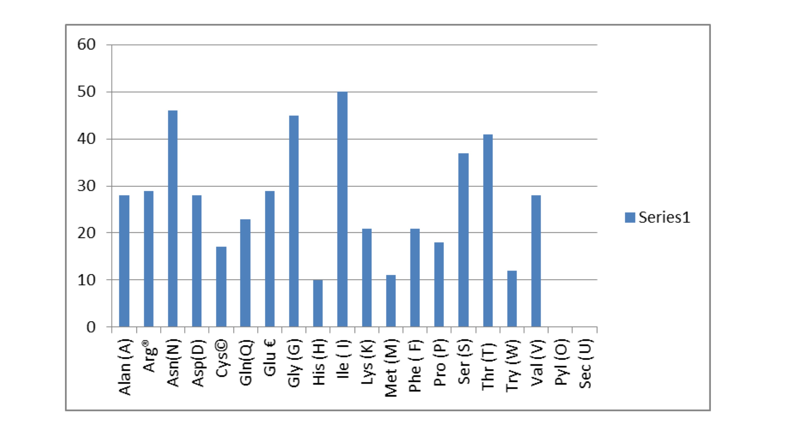

# Avianvac
## Construction of Multiple Epitope Vaccine Against H3N8 Strain of Avian Influenza: A Bioinformatics Approach

## Background
Both humans and animals are at risk from influenza disease.  Four main types of the influenza viruses exist: types A, B, C, and D: The most outstanding characteristic of influenza viruses is their rapid evolution which leads to their great variability.. Types A, B, C, and D of influenza viruses are present. The most notable feature of influenza viruses is their high degree of variety due to their rapid development; this is particularly true with influenza A viruses.  Influenza A viruses have the capacity to overcome species barriers and spread severe pandemics among humans. An influenza pandemic can be brought on by the appearance of a brand-new, radically different influenza A virus with the capacity to infect individuals and maintain sustained human-to-human transmission.

Depending on the host of origin, influenza A viruses can be classified as avian influenza, swine influenza, or other types of animal influenza viruses. Examples include avian influenza "bird flu" virus subtypes A(H5N1) and A(H9N2) or swine influenza "swine flu" virus subtypes A(H1N1) and A(H3N2). All of these animal influenza type A viruses are distinct from human influenza viruses and do not easily transmit among humans. In recent years, many subtypes of avian influenza viruses (AIVs) have been found to be infectious to mammals and to pose a threat to the health of humans and other animals. So far, 11 subtypes of AIVs (mainly H5N1, H5N6, H6N1, H7N7, H7N9, H9N2, and H10N8) have been identified to cause human infections. AIV infections in humans can result in a wide spectrum of illnesses, ranging from conjunctivitis and upper respiratory tract disease to pneumonia and multiorgan failure.  A novel avian influenza virus strain, A H3N8, causing infection in a 4-year-old boy was recently identified in Henan Province, China, which is the first time a human has been infected by this virus strain.   The status of development and availability of A (H3N8) candidate vaccine viruses and potency testing reagents are still in preparation and pending. To date, only inactivated influenza vaccines are available to prevent such infections.

## Objective
This study focuses on constructing a multiple epitope vaccine against the H3N8 strain of avian influenza.

## Methods
- The sequence of H3N8 spike glycoprotein was retrieved from uniprot database (https://www.uniprot.org) with accession number P16995.
- The physicochemical properties of the selected protein were checked by ExPASy-ProtParam tool (https://web.expasy.org/protparam/). The molecular weight, theoretical pI, amino acid and atomic composition, extinction coefficient, estimated half-life, instability index, aliphatic index, and grand average of hydropathicity (GRAVY) are among the parameters that were computed.
- B-cell and T-cell epitopes were predicted using the bioinformatics tool Immune Epitope Database (IEDB) (http://tools.iedb.org/main/).
- The secondary structure of the protein was analyzed by PSIPRED online tool (http://bioinf.cs.ucl.ac.uk/psipred/).
- The antigenicity of the protein was checked using VaxiJen 2.0 (http://www.ddg-pharmfac.net/vaxiJen/VaxiJen/VaxiJen.html).
- Allergenicity of the protein was checked using AllerTOP v2.0, which is an online server (https://www.ddg-pharmfac.net/AllerTOP/method.html).
- The population coverage of the shortlisted 10 epitopes was analyzed by using the IEDB’s Population Coverage (http://tools.iedb.org/population/) with default parameters.
- ToxinPred tool was used for the prediction of toxicity (http://crdd.osdd.net/raghava/toxinpred/)

### Workflow

## Results
The result showed that the sequence is a probable Non-Allergen. Using Vaxijen 2.0 an internet server, we were able to estimate antigenicity of viral protein. To increase specificity the cut off was lowered at 0.4. An examination of full length spike protein sequence shown 0.4991 antigenicity making it probable antigen
### Physicochemical properties of H3N8 Strain
ProtParam showed a molecular weight of 63686.23 Da whereas it contains 565 amino acid units. According to our calculations, the theoretic isoelectric point (PI) was found to be 8.02, which indicates that the protein has negative charge as below this it shows positive charge

### Amino Acid Composition

### Antigenicity of H3N8 Spike protein

### B cell epitopes threshold score and position
The peptide sequence from  15 to 524 amino acids is declared as B-cells epitopes and can speed up the preferred immune response due to its highest antigenicity of 1.0075 ,non-toxicity and non-allergenicity

### Prediction of T-Cell epitopes
### MHC-I T cells
A lower IC50s a higher binding affinity of MHC-I T cell epitopes. The IEDB predicted a total of 2791 T-cells.The antigenicity, Allergenicity and toxicity of 11 epitopes were assessed . The MHC-I epitopes were analyzed and binds to allelesHLA-E*01:01,HLA-G*01:01,HLA-A*01:01, HLA-C*01:02, HLA-B*07:02 .The main epitope GQSGRISI  showed highest antigenicity score of 1.2512

### MHC-II T cells
Ten epitopes were selected for further study on antigenicity, allergenicity,and  toxicity. The epitope LNNRFQIKGVELKSG  was considered to have the highest antigenic score of 1.6233. They bind to the following alleles HLA-DRB1*01:01, HLA-DRB5*01:01, HLA-DRB3*01:01, HLA-DRB4*01:01

### Predicted B cell epitopes

### Population_Coverage
The  population coverage of theT-cells epitopes  across the world . MHC allele was found to be 99.30% in the united states, followed by india (97.39%), the lowest population was found Morocco (25.77%)

### Predicted Secondary Vaccine Candidate Structure

### Multi-Epitope subunit Vaccine Construct

### Predicted Protein structure from iTasser
I-TASSER was used for the construction of the 3D structure. Five models were generated, out of which the best selected based on the C score, the model with high C-score was selected because high value signifies a model with confidence and vice versa.

### Docked_model of Vaccine construct

### Solubility

## Conclusion
The proposed vaccine met all the required criteria together with antigenicity, allergenicity, toxicity and other physicochemical properties. Collectively, our designed vaccine construct is safe; however, preclinical studies/validation must be performed before clinical trials.

## Team Members
- Chimenya Ntweya (Department of Biotechnology and Bioinformatics, Deogiri College, Aurangabad, India; Department of Medical Laboratory, Queen Elizabeth Central Hospital, Blantyre, Malawi) chimenyantweya54@gmail.com
- Ojochenemi Enejoh (Genomics and Bioinformatics Department, National Biotechnology Development Agency, Abuja, Nigeria) chenemidala@gmail.com
- Diabate Oudou diabateoudou@gmail.com
- Angellina Rukundo angellinarukundo@gmail.com
- Ayando Oluwaseun ayandooluwaseunayo@gmail.com
- Margaret Alabi margaretalabi92@gmail.com
- Eniola Onabowale eonabowale@gmail.com
- Wambui Kariithim wambuikariithim@gmail.com
- Adham Hallal adham.hallal@gmail.com
- Lorreta Kwasah kwasahlorreta@gmail.com
- Mamadou Sangare
